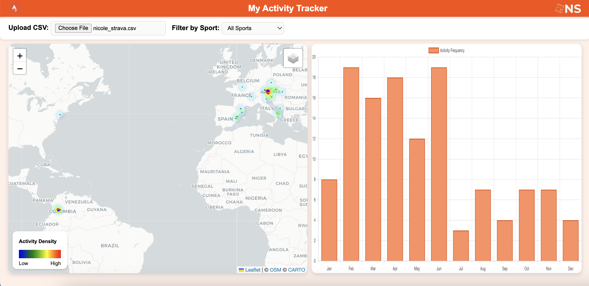

# 🏃 Strava Activity Dashboard

An **interactive web dashboard** that visualizes your Strava activities from a CSV export.  
Upload your file, explore your routes on a map, and see your stats in an interactive chart — all in your browser.

---

## Preview

**Dashboard Overview**  


**Demo GIF**  


---

## Features
- 📂 **Upload CSV** — load your Strava data instantly (csv fetched by using the Strava API -https://developers.strava.com/docs/getting-started/-).
- 🗺 **Interactive Map** — zoom, pan, and view your activities.
- 📊 **Dynamic Chart** — visualize distance, elevation, or time.
- 🔍 **Sport Filter** — view activities by sport type.
- 📱 **Responsive Layout** — works on laptops, tablets, and mobiles.
- 💬 **Welcome Modal** — friendly intro for first-time visitors.

---

## Project Structure
project/
│
├── index.html # Main HTML structure
├── style.css # Layout and styling
├── script.js # App logic 
├── images/ # Logos, screenshots, GIFs
│ ├── strava.png # Strava Logo
│ ├── NS.png # Personal Logo
│ ├── dashboard-screenshot.png
│ └── dashboard-demo.gif
└── README.md # This file

---

## How to Use

1. **Download or Clone** this repository.
   ```bash
   git clone https://github.com/nicolevasos/strava-dashboard.git

2. Open index.html in your browser.

3. Upload your Strava CSV export file.
  Go to Strava,
   - Export your activity:
     Manually- data from Settings → My Data → Download.
     API- https://developers.strava.com/docs/getting-started/

   - Make sure the file includes:
     - name
     - sport_type
     - distance
     - total_elevation_gain
     - moving_time
     - map.summary_polyline
  4. Explore!
     - Use the map to view routes.
     - Check the chart for activity metrics.
     - Filter by sport for detailed insights.
    
## Technologies

Leaflet.js — interactive maps

Chart.js — beautiful charts

PapaParse — CSV parsing

Mapbox Polyline — decoding Strava routes

## License

This project is open source.
Feel free to use and modify under the MIT License.

